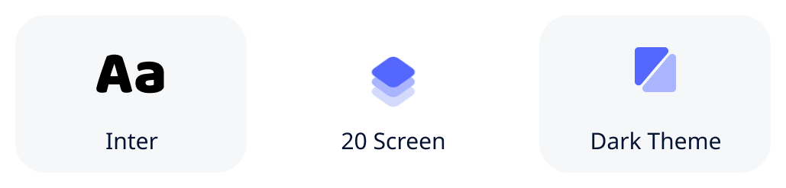
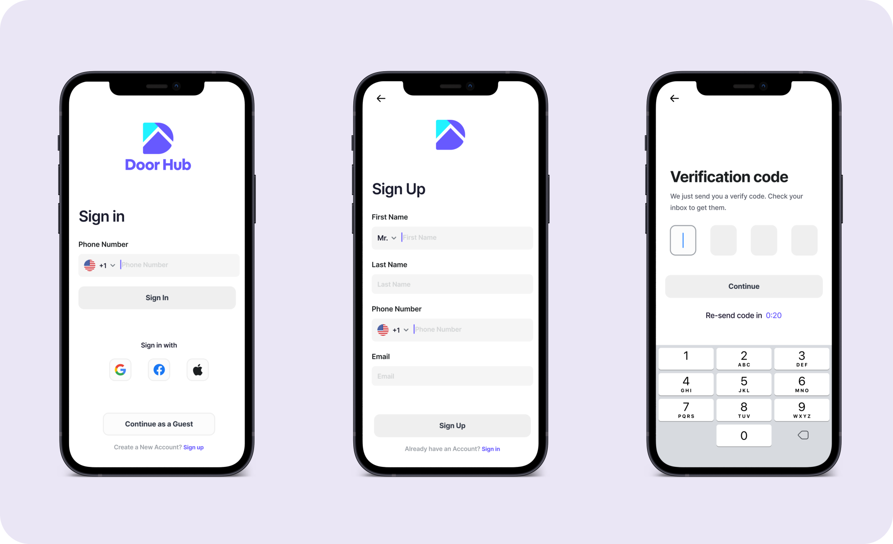
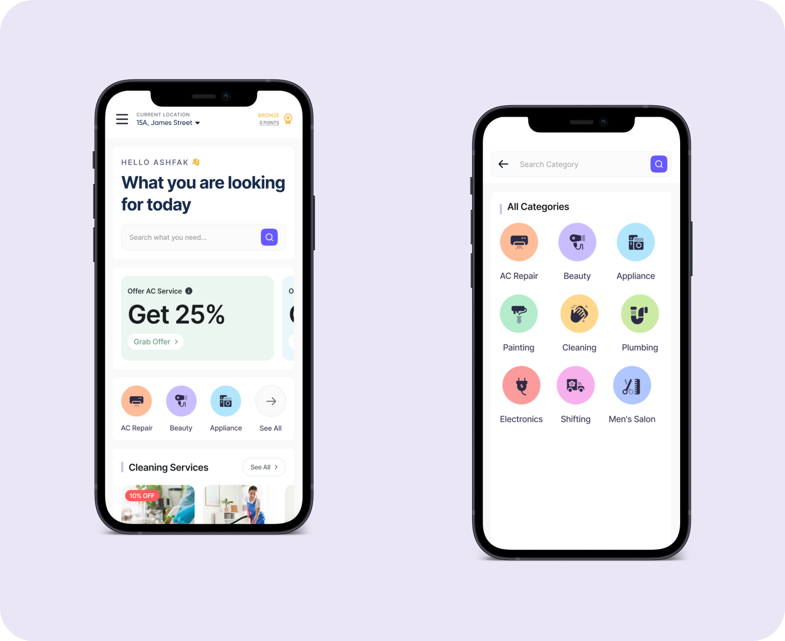
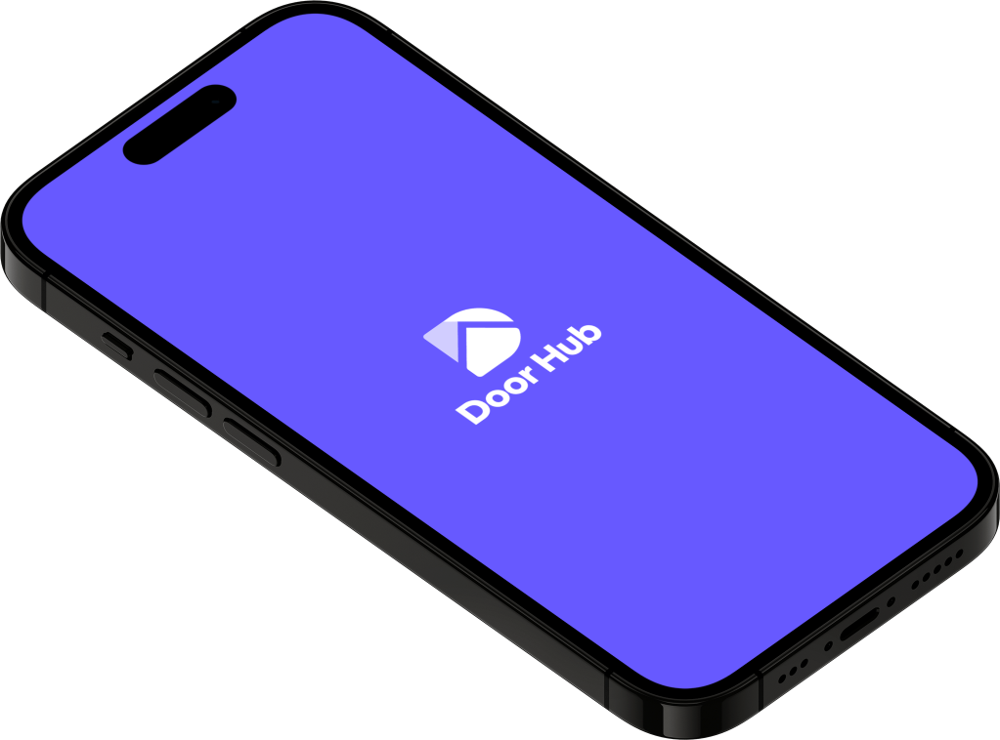

# Door Hub 

It is a Home Service Mobile App UI Kit with a clean and modern style. The kit is available in light and dark mode including global color and font style. DoorHub gives you a well-layered method, pixel-perfect design, free unique font, and supporting organized components to make it easier. 100% vector editable and scalable.

## Highlight ⚡

## Screens 📱

## Techniques used 🛠️

- Minimum SDK level 21
- Architecture
    - MVC
- [GetX](https://pub.dev/packages/get) - GetX is an extra-light and powerful solution for Flutter.
    - [get_storage](https://pub.dev/packages/get_storage) - A fast, extra light and synchronous key-value in memory, which backs up data to disk at each operation.
- [animations](https://pub.dev/packages/animations) - Contains pre-canned animations for commonly-desired effects.
- [table_calendar](https://pub.dev/packages/table_calendar) - Highly customizable, feature-packed calendar widget for Flutter
- [flutter_native_splash](https://pub.dev/packages/flutter_native_splash) - Automatically generates iOS, Android, and Web-native code for customizing this native splash screen background color and splash image
- [flutter_launcher_icons](https://pub.dev/packages/flutter_launcher_icons) - A command-line tool which simplifies the task of updating your Flutter app's launcher icon.
- [Flutter Screen Util](https://pub.dev/packages/flutter_screenutil) - Used for responsive design in Flutter apps, provides a simple way to scale UI elements and layouts based on the device's screen size and pixel density using a set of utility functions and classes.
- [smooth_page_indicator](https://pub.dev/packages/smooth_page_indicator) - Customizable animated page indicator with a set of built-in effects.
- [google_fonts](https://pub.dev/packages/google_fonts) - Provides a set of free and open-source fonts from the Google Fonts library.
- [carousel_slider](https://pub.dev/packages/carousel_slider) - simple customizable widget for displaying a sequence of images.
- [flutter_svg](https://pub.dev/packages/flutter_svg) - An SVG rendering and widget library for Flutter, which allows painting and displaying Scalable Vector Graphics 1.1 files.
- [credit_card_scanner](https://pub.dev/packages/credit_card_scanner) - A flutter plugin for accurately and quickly scanning debit and credit cards.

---

