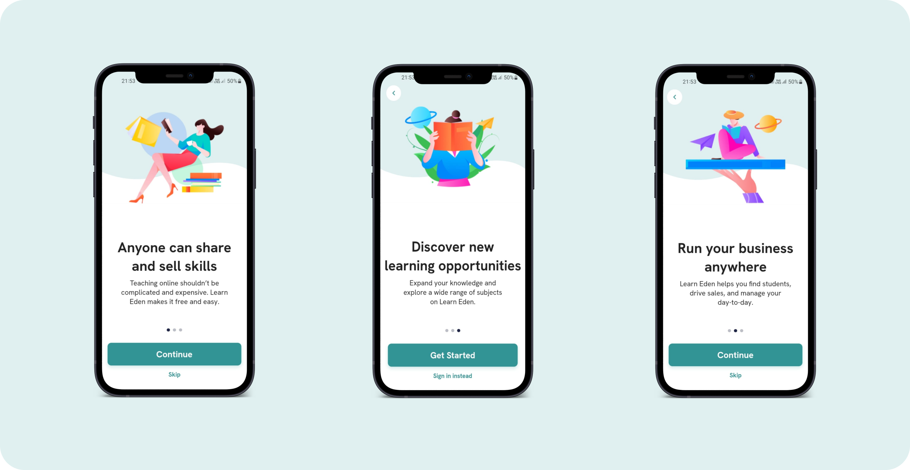
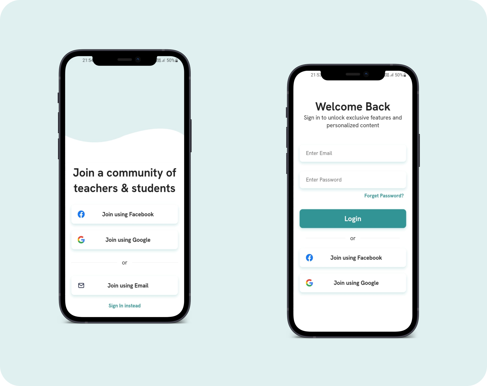
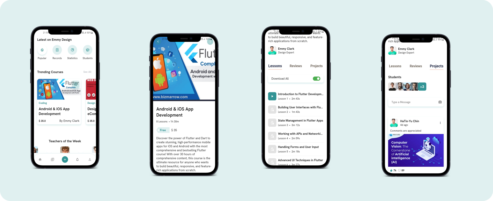
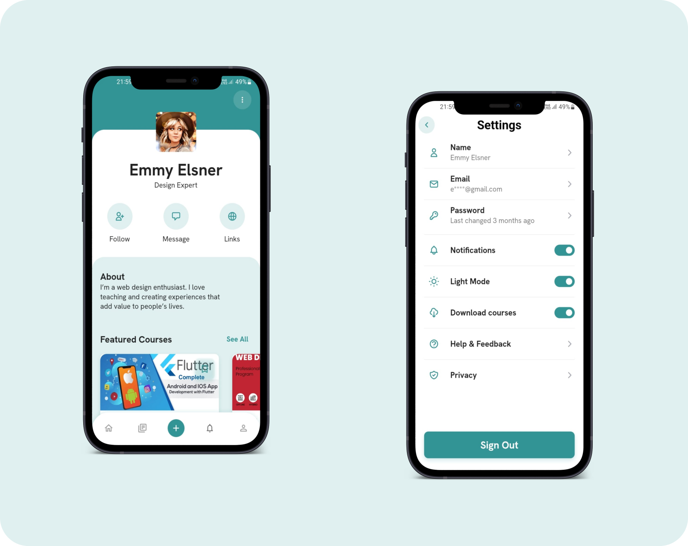
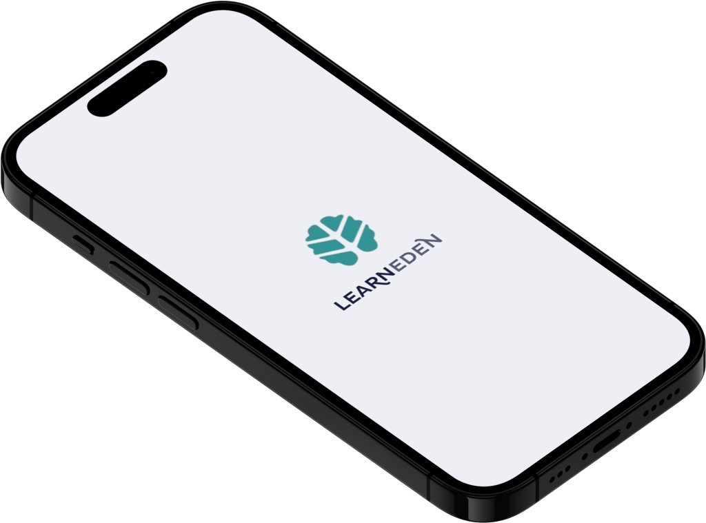

# Eden
Learn Eden is a premium UI kit consists of 30+ screens you can use on your next learning/teaching app. This UI Kit uses reusable components and smart layout with constraints so you can use it on any screen size.

## Screens

## Techniques used 🛠️

- Minimum SDK level 21
- Architecture
    - MVC
- [GetX](https://pub.dev/packages/get) - GetX is an extra-light and powerful solution for Flutter.
- [animate_do](https://pub.dev/packages/animate_do) - An animation package inspired in Animate.css, built using only Flutter animations
- [surf_lint_rules](https://pub.dev/packages/surf_lint_rules) - This package is part of the SurfGear toolkit made by Surf.
- [flutter_native_splash](https://pub.dev/packages/flutter_native_splash) - Automatically generates iOS, Android, and Web-native code for customizing this native splash screen background color and splash image
- [Flutter Screen Util](https://pub.dev/packages/flutter_screenutil) - Used for responsive design in Flutter apps, provides a simple way to scale UI elements and layouts based on the device's screen size and pixel density using a set of utility functions and classes.
- [smooth_page_indicator](https://pub.dev/packages/smooth_page_indicator) - Customizable animated page indicator with a set of built-in effects.
- [flutter_swipe_button](https://pub.dev/packages/flutter_swipe_button) - Avoid accidental clicks or dialogs to prevent them using SwipeButton.
- [flutter_staggered_animations](https://pub.dev/packages/flutter_staggered_animations) - Easily add staggered animations to your `ListView`, `GridView`, `Column` and `Row`.
- [flutter_svg](https://pub.dev/packages/flutter_svg) - An SVG rendering and widget library for Flutter, which allows painting and displaying Scalable Vector Graphics 1.1 files.
- [confetti](https://pub.dev/packages/confetti) - Blast some confetti all over the screen and celebrate user achievements!
- [fl_chart](https://pub.dev/packages/fl_chart) - A highly customizable Flutter chart library that supports Line Chart, Bar Chart, Pie Chart, Scatter Chart, and Radar Chart.
