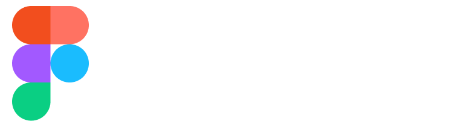

# Featured - The Color of Food 

## Techniques used 🛠️

- Minimum SDK level 21
- Architecture
    - MVC
- [smooth_page_indicator](https://pub.dev/packages/smooth_page_indicator) - Customizable animated page indicator with a set of built-in effects.
- [expandable_page_view](https://pub.dev/packages/expandable_page_view) - A PageView widget adjusting its height to currently displayed page. It accepts the same parameters as classic PageView.
- [flutter_bloc](https://pub.dev/packages/flutter_bloc) - Widgets that make it easy to integrate blocs and cubits into Flutter. Built to work with package:bloc.

---

   
