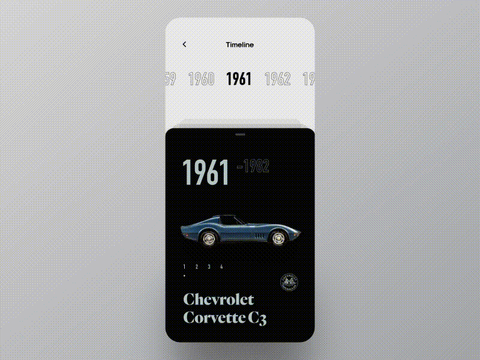
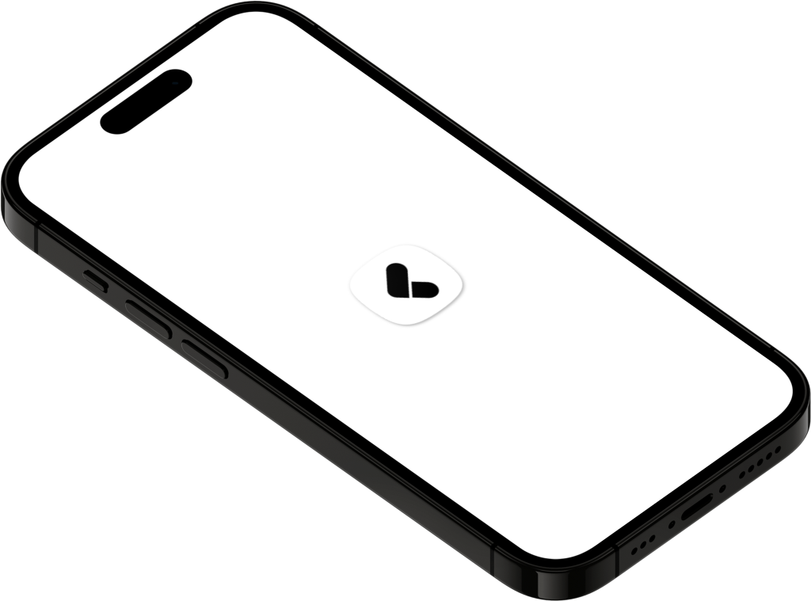
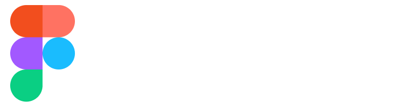

# Cars Encyclopedia Interaction

## Techniques used 🛠️

- Minimum SDK level 21
- Architecture
    - MVC
- [animations](https://pub.dev/packages/animations) - Contains pre-canned animations for commonly-desired effects.
- [card_slider](https://pub.dev/packages/card_slider) - A draggable Flutter image carousel slider on swipe or drag! Card slider for carousel images and widgets. This widget works on both Android & iOS.
- [flutter_native_splash](https://pub.dev/packages/flutter_native_splash) - Automatically generates iOS, Android, and Web-native code for customizing this native splash screen background color and splash image
- [flutter_launcher_icons](https://pub.dev/packages/flutter_launcher_icons) - A command-line tool which simplifies the task of updating your Flutter app's launcher icon.
- [animated_theme_switcher](https://pub.dev/packages/animated_theme_switcher) - This library starts from Peyman's stackoverflow question how-to-add-animation-for-theme-switching-in-flutter.
- [flutter_animate](https://pub.dev/packages/flutter_animate) - A performant library that makes it simple to add almost any kind of animated effect in Flutter.
- [google_fonts](https://pub.dev/packages/google_fonts) - Provides a set of free and open-source fonts from the Google Fonts library.
- [carousel_slider](https://pub.dev/packages/carousel_slider) - simple customizable widget for displaying a sequence of images.
- [flutter_card_swiper](https://pub.dev/packages/flutter_card_swiper) - It allows you to swipe left, right, up, and down and define your own business logic for each direction.

---

   