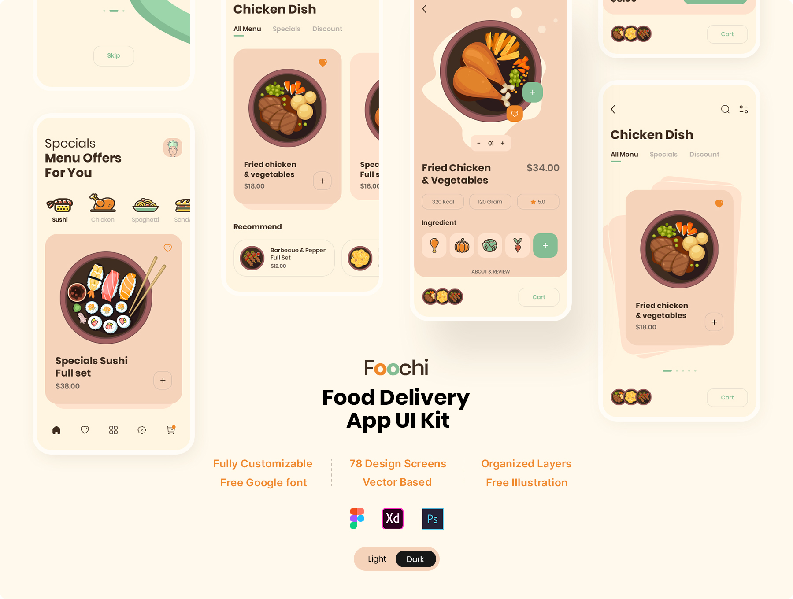
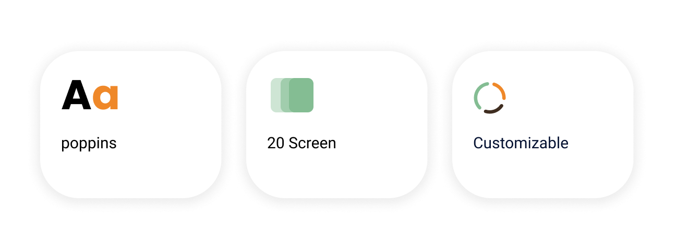
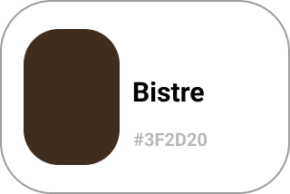
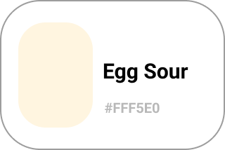
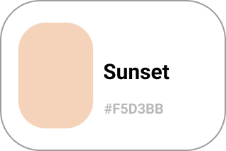
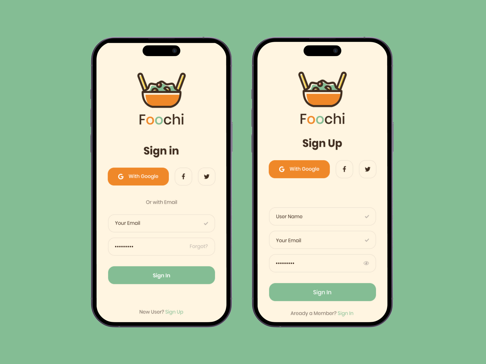
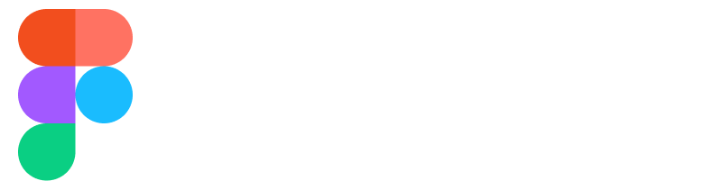

# Foochi - Food Delivery App UI 

Foochi is a productivity app iOS UI Kit for Figma, XD and Photoshop. Professional application for online travel booking service. Designed with clean screen design trends. This modern design template is easy to customize. 

## Highlight ⚡

## Colors 🎨

 

 
 
 
 
 
 
 
 

## Screens 📱

 

## Techniques used 🛠️

- Minimum SDK level 21
- Architecture
    - MVC
- [GetX](https://pub.dev/packages/get) - GetX is an extra-light and powerful solution for Flutter.
- [animate_do](https://pub.dev/packages/animate_do) - An animation package inspired in Animate.css, built using only Flutter animations
- [table_calendar](https://pub.dev/packages/table_calendar) - Highly customizable, feature-packed calendar widget for Flutter
- [flutter_native_splash](https://pub.dev/packages/flutter_native_splash) - Automatically generates iOS, Android, and Web-native code for customizing this native splash screen background color and splash image
- [flutter_launcher_icons](https://pub.dev/packages/flutter_launcher_icons) - A command-line tool which simplifies the task of updating your Flutter app's launcher icon.
- [Flutter Screen Util](https://pub.dev/packages/flutter_screenutil) - Used for responsive design in Flutter apps, provides a simple way to scale UI elements and layouts based on the device's screen size and pixel density using a set of utility functions and classes.
- [dots_indicator](https://pub.dev/packages/dots_indicator) - Widget to display dots indicator to show a position (for a PageView for example).
- [google_fonts](https://pub.dev/packages/google_fonts) - Provides a set of free and open-source fonts from the Google Fonts library.
- [card_swiper](https://pub.dev/packages/card_swiper) - Swiper/Carousel for flutter, with multiple layouts, infinite loop. Compatible with Android & iOS.
- [flutter_svg](https://pub.dev/packages/flutter_svg) - An SVG rendering and widget library for Flutter, which allows painting and displaying Scalable Vector Graphics 1.1 files.
- [flutter_staggered_animations](https://pub.dev/packages/flutter_staggered_animations) - Easily add staggered animations to your `ListView`, `GridView`, `Column` and `Row`.
- [like_button](https://pub.dev/packages/like_button) - Like Button is a flutter library that allows you to create a button with animation effects similar to Twitter's
- [flutter_slidable](https://pub.dev/packages/flutter_slidable) - A Flutter implementation of slidable list item with directional slide actions that can be dismissed.
- [simple_animations](https://pub.dev/packages/simple_animations) - Powerful package to create beautiful custom animations in no time.
- [image_stack](https://pub.dev/packages/image_stack) -  is a pure dart package for creating image stack in Flutter.
- [flutter_rating_bar](https://pub.dev/packages/flutter_rating_bar) -  A simple yet fully customizable rating bar for flutter which also include a rating bar indicator, supporting any fraction of rating.
- [flutter_easyloading](https://pub.dev/packages/flutter_easyloading) -  A clean and lightweight loading/toast widget for Flutter, Easy to use without context, Support iOS、Android and Web
- [image_picker](https://pub.dev/packages/image_picker) -  A Flutter plugin for iOS and Android for picking images from the image library, and taking new pictures with the camera.

---

   