

# Ngamar - Furniture App UI Kit

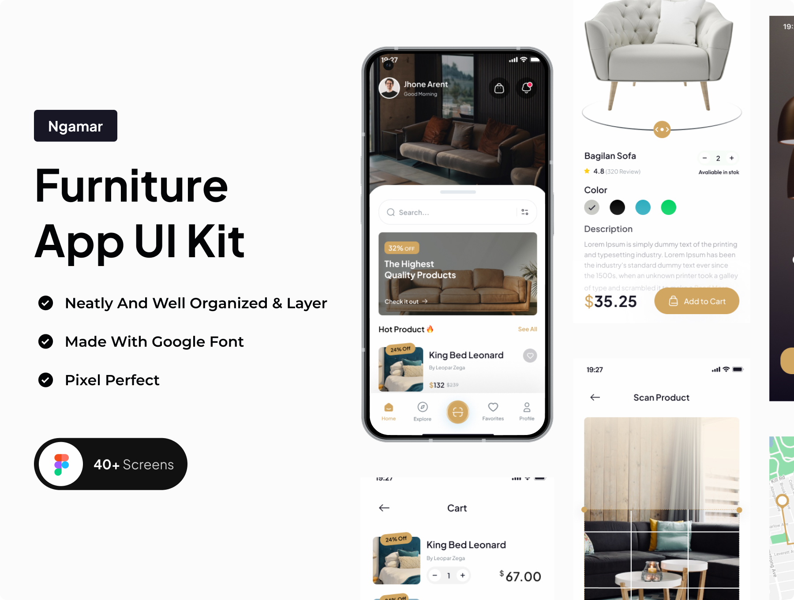

Ngamar is a High Quality UI Kit of an Furniture Mobile App UI Kit. Ngamar came with a modern minimalistic design. The kit has been equipped with grouping and naming for each group so that you can edit it more easily.

## Highlight ⚡
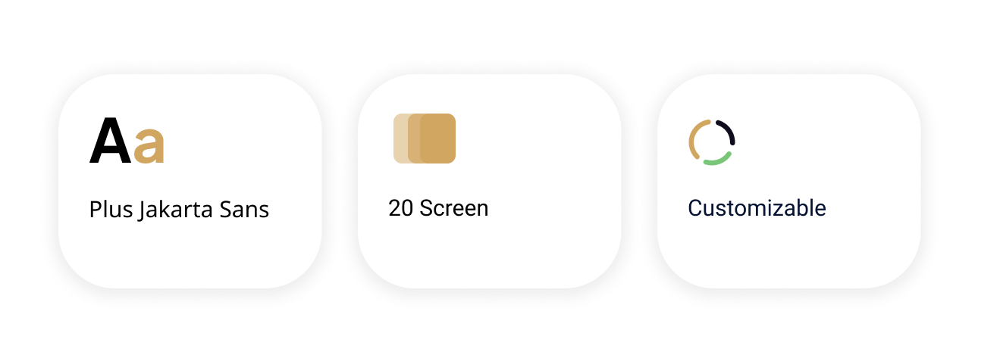

## Colors 🎨

 
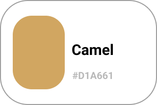
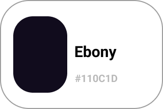
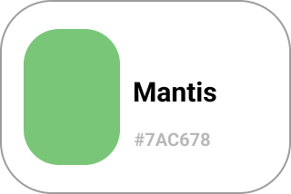
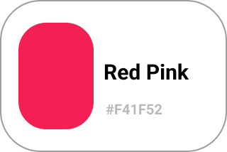
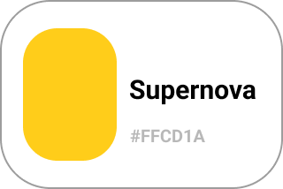
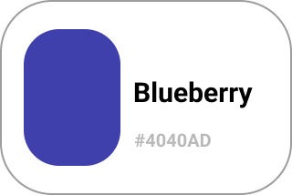
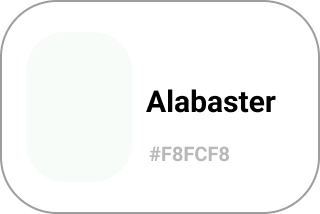

 
 
 
 
 
 
 

## Screens
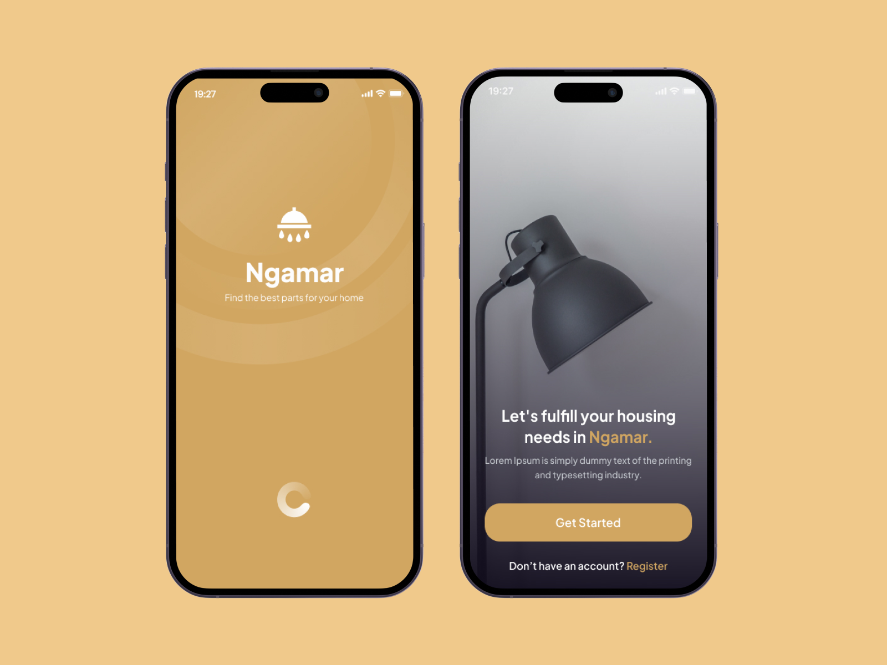
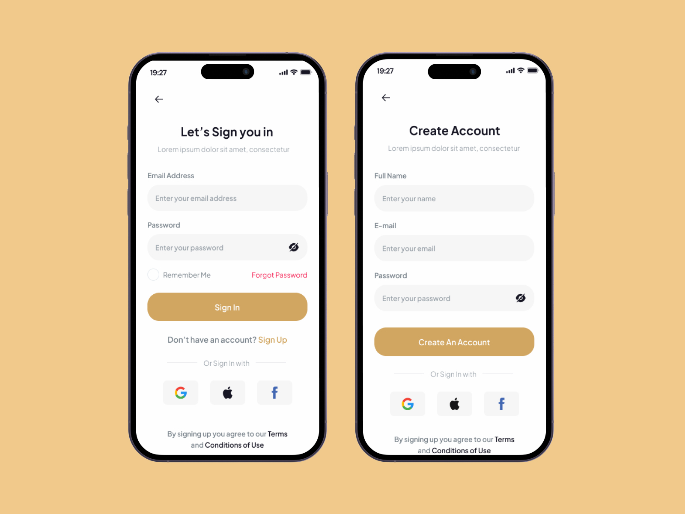
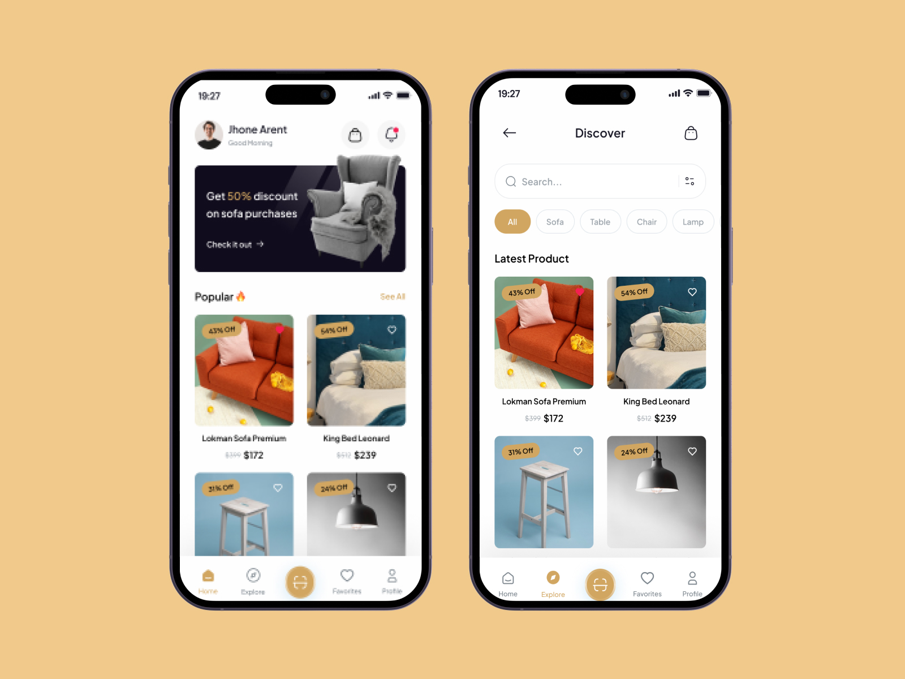
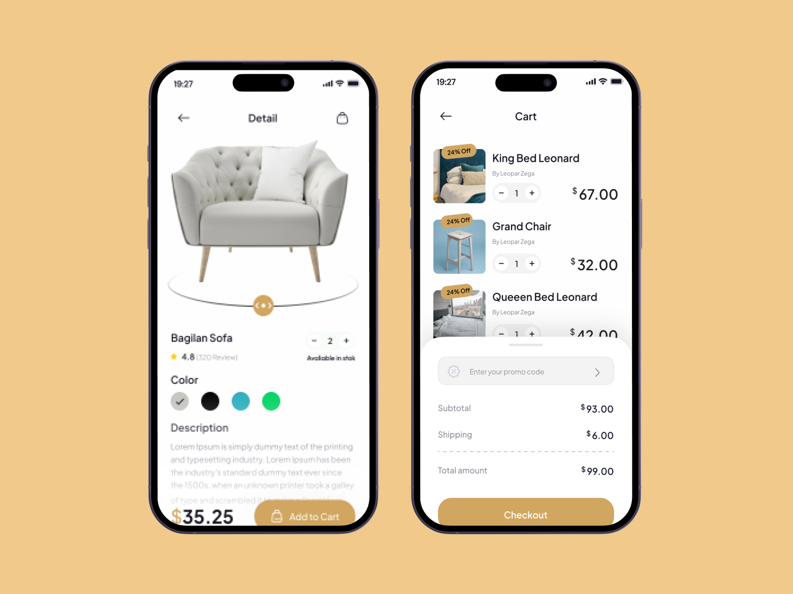

## Techniques used 🛠️

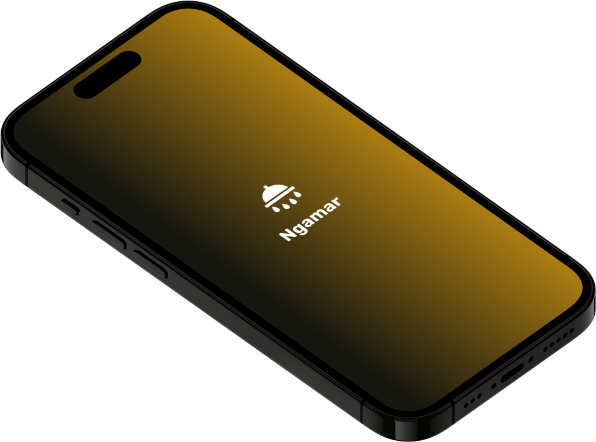

- Minimum SDK level 21
- Architecture
    - MVC
- [GetX](https://pub.dev/packages/get) - GetX is an extra-light and powerful solution for Flutter.
- [flutter_launcher_icons](https://pub.dev/packages/flutter_launcher_icons) - A command-line tool which simplifies the task of updating your Flutter app's launcher icon.
- [Flutter Screen Util](https://pub.dev/packages/flutter_screenutil) - Used for responsive design in Flutter apps, provides a simple way to scale UI elements and layouts based on the device's screen size and pixel density using a set of utility functions and classes.
- [dots_indicator](https://pub.dev/packages/dots_indicator) - Widget to display dots indicator to show a position (for a PageView for example).
- [google_fonts](https://pub.dev/packages/google_fonts) - Provides a set of free and open-source fonts from the Google Fonts library.
- [flutter_svg](https://pub.dev/packages/flutter_svg) - An SVG rendering and widget library for Flutter, which allows painting and displaying Scalable Vector Graphics 1.1 files.
- [simple_animations](https://pub.dev/packages/simple_animations) - Powerful package to create beautiful custom animations in no time.
- [animate_do](https://pub.dev/packages/animate_do) - An animation package inspired in Animate.css, built using only Flutter animations
- [like_button](https://pub.dev/packages/like_button) - Like Button is a flutter library that allows you to create a button with animation effects similar to Twitter's
- [flutter_staggered_animations](https://pub.dev/packages/flutter_staggered_animations) - Easily add staggered animations to your `ListView`, `GridView`, `Column` and `Row`.
- [blur](https://pub.dev/packages/blur) -  Blur is a wrapper widget that blur it's child. There are ImageBlur.asset and ImageBlur.network that blur the image. Frost is another wrapper which blurs the background.
- [audioplayers](https://pub.dev/packages/audioplayers) -  A Flutter plugin to play multiple audio files simultaneously

---

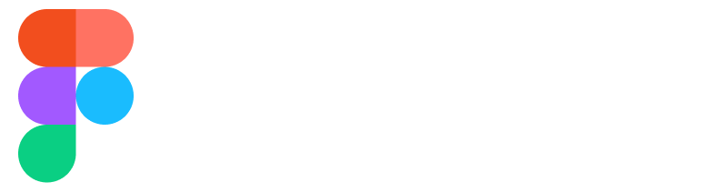   

UI Reference : [Ui8](https://ui8.net/majeng-karya-c3e03b/products/ngamar---furniture-app-ui-kit)