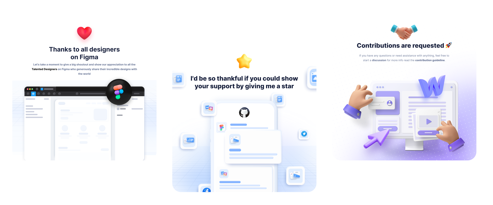

Each application in this collection is a work of art, the result of a combination of brilliant design concepts with the advanced features of the Flutter framework. As you explore the rich environments of these applications, you will be taken to a world where beauty and utility mix together.

 

 

> **Note**  
> *1 - To get more information, click on the icons.*                                
> *2 - The icons that have the Flutter logo are up to `Flutter UI dev`*

## Applications 🚀

